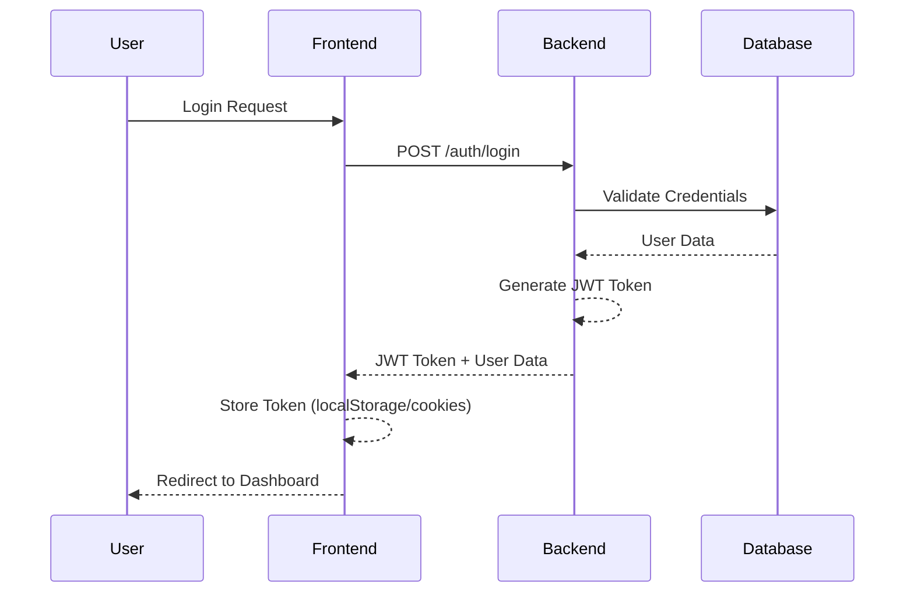
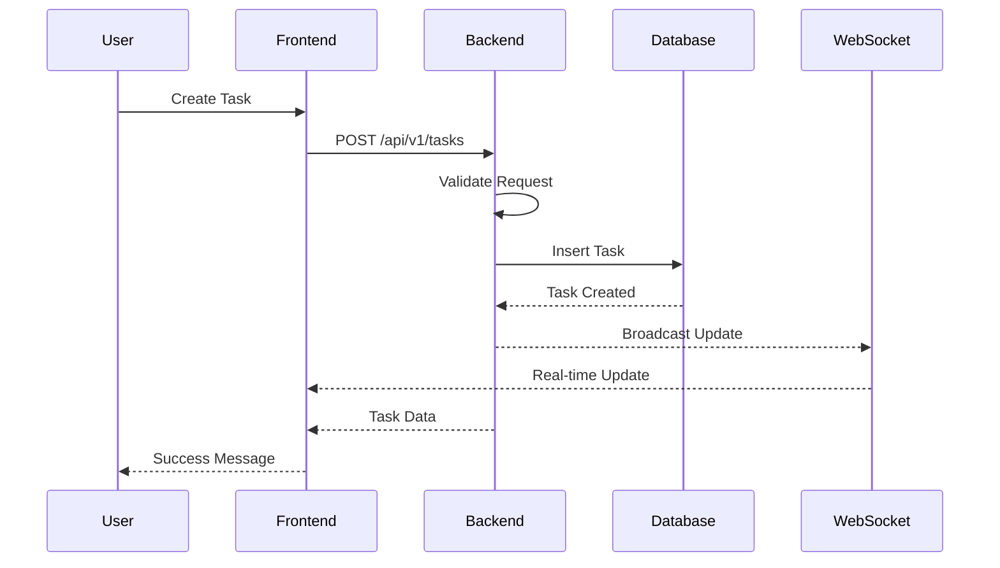
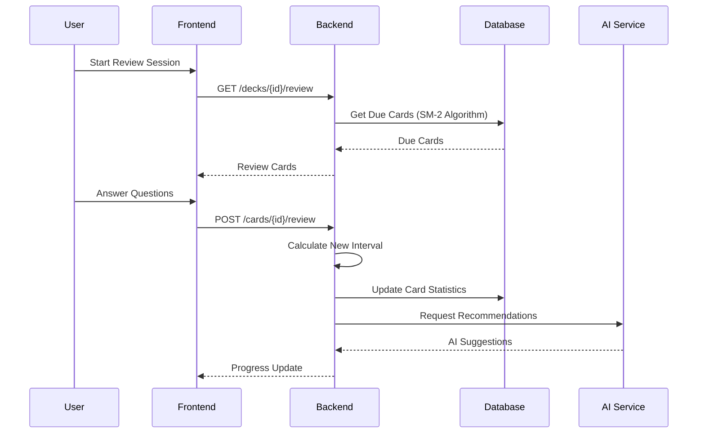
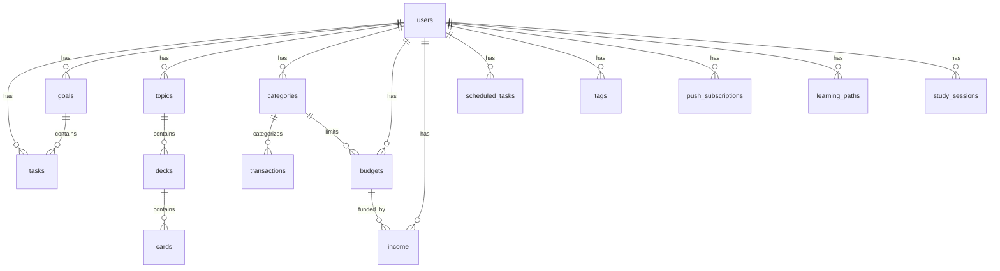

# Architecture Overview

## System Design

The Hub is a modern full-stack productivity application built with scalability, maintainability, and user experience in mind. This document provides a comprehensive overview of the system architecture, design patterns, and technical decisions.

## 🏗 System Architecture

### High-Level Architecture

```
┌─────────────────┐    ┌─────────────────┐    ┌─────────────────┐
│   Frontend      │    │   Backend API   │    │   Database      │
│   (Nuxt.js)     │◄──►│   (Go/Gin)      │◄──►│   (PostgreSQL)  │
│                 │    │                 │    │                 │
│ • Vue 3         │    │ • REST API      │    │ • User Data     │
│ • TypeScript    │    │ • JWT Auth      │    │ • Tasks/Goals   │
│ • PWA           │    │ • WebSocket     │    │ • Learning Data │
│ • Pinia         │    │ • AI Integration│    │ • Finance Data  │
└─────────────────┘    └─────────────────┘    └─────────────────┘
       │                       │                       │
       └───────────────────────┼───────────────────────┘
                               │
                    ┌─────────────────┐
                    │   External      │
                    │   Services      │
                    │                 │
                    │ • OpenRouter AI │
                    │ • Calendar APIs │
                    │ • Push Services │
                    │ • Email Service │
                    └─────────────────┘
```

### Component Architecture

#### Frontend Architecture

**Framework & Language:**
- **Nuxt.js 3**: Vue.js meta-framework for SSR, SSG, and SPA capabilities
- **Vue 3**: Progressive JavaScript framework with Composition API
- **TypeScript**: Static type checking for better code quality and developer experience

**State Management:**
- **Pinia**: Intuitive state management library for Vue
- **Persistent State**: Automatic state persistence across sessions
- **Reactive Stores**: Real-time data synchronization

**UI & Styling:**
- **Tailwind CSS**: Utility-first CSS framework
- **Custom Design System**: Consistent component library
- **Dark Mode Support**: System preference detection and manual toggle
- **Responsive Design**: Mobile-first approach with breakpoint utilities

**Progressive Web App:**
- **Service Worker**: Offline capabilities and caching
- **Web App Manifest**: Installable PWA experience
- **Push Notifications**: Real-time notifications via service workers

#### Backend Architecture

**Language & Framework:**
- **Go 1.24+**: High-performance compiled language
- **Gin Framework**: Fast HTTP web framework
- **GORM**: Feature-rich ORM for database operations

**API Design:**
- **RESTful Architecture**: Consistent HTTP methods and status codes
- **JWT Authentication**: Stateless authentication with refresh tokens
- **Rate Limiting**: Protection against abuse and DoS attacks
- **CORS Support**: Cross-origin resource sharing configuration

**Database Layer:**
- **PostgreSQL**: Robust relational database for production
- **SQLite**: Lightweight database for development
- **GORM Migrations**: Automated schema management
- **Connection Pooling**: Efficient database connection management

**Real-time Features:**
- **WebSocket Support**: Real-time updates and notifications
- **Server-Sent Events**: One-way real-time communication
- **Background Jobs**: Asynchronous task processing

### Data Flow Architecture

#### User Authentication Flow



#### Task Management Flow



#### Learning Session Flow



## 📊 Database Design

### Schema Overview

```sql
-- Core Tables
users (user_id, name, email, password, settings, created_at, updated_at)
tasks (task_id, user_id, title, description, status, priority, due_date, goal_id, order, created_at, updated_at)
goals (goal_id, user_id, title, description, category, status, target_date, progress, created_at, updated_at)

-- Learning Tables
topics (topic_id, user_id, name, description, created_at, updated_at)
decks (deck_id, user_id, topic_id, name, description, created_at, updated_at)
cards (card_id, deck_id, question, answer, repetitions, easiness, interval, next_review, created_at, updated_at)

-- Finance Tables
transactions (transaction_id, user_id, amount, description, category_id, date, type, created_at, updated_at)
categories (category_id, user_id, name, type, color, created_at, updated_at)
budgets (budget_id, user_id, amount, category_id, start_date, end_date, created_at, updated_at)
income (income_id, user_id, name, amount, frequency, start_date, created_at, updated_at)

-- Time Management Tables
scheduled_tasks (schedule_id, user_id, title, description, start_time, end_time, category, created_at, updated_at)
calendar_integrations (integration_id, user_id, provider, calendar_id, sync_enabled, created_at, updated_at)
calendar_zones (zone_id, user_id, name, color, start_time, end_time, days, created_at, updated_at)

-- Additional Tables
tags (tag_id, user_id, name, color, created_at, updated_at)
push_subscriptions (subscription_id, user_id, endpoint, p256dh_key, auth_key, created_at, updated_at)
learning_paths (path_id, user_id, title, description, topics, created_at, updated_at)
study_sessions (session_id, user_id, topic_id, duration, notes, created_at)
```

### Database Relationships



### Indexing Strategy

```sql
-- Performance indexes
CREATE INDEX idx_tasks_user_status ON tasks(user_id, status);
CREATE INDEX idx_tasks_due_date ON tasks(due_date);
CREATE INDEX idx_cards_next_review ON cards(next_review);
CREATE INDEX idx_transactions_date ON transactions(date);
CREATE INDEX idx_scheduled_tasks_start_time ON scheduled_tasks(start_time);

-- Full-text search indexes
CREATE INDEX idx_tasks_title_description ON tasks USING gin(to_tsvector('english', title || ' ' || description));
CREATE INDEX idx_cards_question_answer ON cards USING gin(to_tsvector('english', question || ' ' || answer));
```

## 🔐 Security Architecture

### Authentication & Authorization

**JWT Token Structure:**
```json
{
  "header": {
    "alg": "HS256",
    "typ": "JWT"
  },
  "payload": {
    "user_id": "uuid",
    "email": "user@example.com",
    "exp": 1640995200,
    "iat": 1640991600,
    "iss": "the-hub"
  },
  "signature": "base64-encoded-signature"
}
```

**Security Features:**
- **Password Hashing**: bcrypt with configurable cost
- **Token Expiration**: Short-lived access tokens with refresh tokens
- **Secure Headers**: HTTP security headers (HSTS, CSP, X-Frame-Options)
- **Input Validation**: Comprehensive request validation
- **SQL Injection Prevention**: Parameterized queries via GORM
- **XSS Protection**: Input sanitization and safe rendering

### API Security

**Rate Limiting:**
```go
// Rate limiting configuration
rateLimit := tollbooth.NewLimiter(1, nil) // 1 request per second
rateLimit.SetIPLookups([]string{"X-Real-IP", "X-Forwarded-For"})
rateLimit.SetMethods([]string{"GET", "POST", "PUT", "DELETE"})
```

**CORS Configuration:**
```go
corsConfig := cors.Config{
    AllowOrigins:     []string{"http://localhost:3000", "https://the-hub.com"},
    AllowMethods:     []string{"GET", "POST", "PUT", "DELETE", "OPTIONS"},
    AllowHeaders:     []string{"Origin", "Content-Type", "Authorization"},
    AllowCredentials: true,
    MaxAge:           12 * time.Hour,
}
```

## 🚀 Performance Architecture

### Database Optimization

**Connection Pooling:**
```go
sqlDB, err := db.DB()
sqlDB.SetMaxIdleConns(10)
sqlDB.SetMaxOpenConns(100)
sqlDB.SetConnMaxLifetime(time.Hour)
```

**Query Optimization:**
- **Eager Loading**: Preload related data to reduce N+1 queries
- **Pagination**: Limit result sets for large datasets
- **Indexing**: Strategic indexes on frequently queried fields
- **Query Caching**: Redis caching for expensive operations

### Frontend Performance

**Code Splitting:**
```typescript
// Dynamic imports for route-based splitting
const Dashboard = () => import('~/pages/dashboard.vue')
const Finance = () => import('~/pages/finance.vue')
```

**Asset Optimization:**
- **Image Optimization**: Automatic WebP conversion and responsive images
- **Bundle Analysis**: Webpack bundle analyzer for optimization
- **Lazy Loading**: Components loaded on demand
- **Service Worker Caching**: Intelligent caching strategies

### Backend Performance

**Concurrent Processing:**
```go
// Goroutines for concurrent request handling
go func() {
    // Background task processing
    processBackgroundJobs()
}()
```

**Response Compression:**
```go
router.Use(gin.Recovery())
router.Use(gzip.Gzip(gzip.DefaultCompression))
```

## 📱 Progressive Web App Architecture

### Service Worker Strategy

```javascript
// Cache-first strategy for static assets
workbox.routing.registerRoute(
  /\.(?:png|jpg|jpeg|svg|gif|ico)$/,
  new workbox.strategies.CacheFirst({
    cacheName: 'images',
    plugins: [
      new workbox.expiration.ExpirationPlugin({
        maxEntries: 60,
        maxAgeSeconds: 30 * 24 * 60 * 60, // 30 days
      }),
    ],
  })
)

// Network-first strategy for API calls
workbox.routing.registerRoute(
  /^https:\/\/api\.the-hub\.com/,
  new workbox.strategies.NetworkFirst({
    cacheName: 'api-cache',
    plugins: [
      new workbox.cacheableResponse.CacheableResponsePlugin({
        statuses: [0, 200],
      }),
    ],
  })
)
```

### Offline Capabilities

**Offline Data Synchronization:**
```typescript
// Background sync for offline actions
if ('serviceWorker' in navigator && 'sync' in window.ServiceWorkerRegistration.prototype) {
  navigator.serviceWorker.ready.then(registration => {
    return registration.sync.register('background-sync')
  })
}
```

## 🔄 Real-time Architecture

### WebSocket Implementation

**Connection Management:**
```go
// WebSocket upgrade
conn, err := upgrader.Upgrade(c.Writer, c.Request, nil)
if err != nil {
    return
}

// Connection handling
for {
    messageType, message, err := conn.ReadMessage()
    if err != nil {
        break
    }

    // Process message and broadcast updates
    hub.broadcast <- message
}
```

**Real-time Events:**
- **Task Updates**: Real-time task status changes
- **Goal Progress**: Live progress updates
- **Notifications**: Instant notification delivery
- **Collaboration**: Real-time collaborative editing
- **Calendar Sync**: Live calendar updates

## 📊 Monitoring & Observability

### Application Monitoring

**Health Checks:**
```go
// Health endpoint
router.GET("/health", func(c *gin.Context) {
    health := map[string]interface{}{
        "status": "ok",
        "timestamp": time.Now(),
        "version": "1.0.0",
    }

    // Database health check
    if err := db.DB().Ping(); err != nil {
        health["database"] = "unhealthy"
        c.JSON(503, health)
        return
    }

    health["database"] = "healthy"
    c.JSON(200, health)
})
```

**Metrics Collection:**
```go
// Prometheus metrics
requestCount := prometheus.NewCounterVec(
    prometheus.CounterOpts{
        Name: "http_requests_total",
        Help: "Total number of HTTP requests",
    },
    []string{"method", "endpoint", "status"},
)
```

### Logging Strategy

**Structured Logging:**
```go
logger.WithFields(logrus.Fields{
    "user_id": userID,
    "action": "task_created",
    "task_id": taskID,
    "ip": c.ClientIP(),
    "user_agent": c.GetHeader("User-Agent"),
}).Info("Task created successfully")
```

**Log Levels:**
- **DEBUG**: Detailed debugging information
- **INFO**: General information about application operation
- **WARN**: Warning messages for potentially harmful situations
- **ERROR**: Error messages for serious problems
- **FATAL**: Critical errors that cause application termination

## 🚀 Deployment Architecture

### Development Environment

**Local Development Setup:**
```bash
# Install PostgreSQL locally
# macOS with Homebrew
brew install postgresql
brew services start postgresql

# Ubuntu/Debian
sudo apt install postgresql postgresql-contrib
sudo systemctl start postgresql

# Create development database
createdb the_hub_dev
createuser dev --createdb
psql -c "ALTER USER dev PASSWORD 'dev_password';"

# Install Redis
# macOS
brew install redis
brew services start redis

# Ubuntu/Debian
sudo apt install redis-server
sudo systemctl start redis

# Run backend with hot reload
cd the-hub-backend
go run github.com/cosmtrek/air@latest
```

### Production Environment

**Production Deployment:**
```bash
# Server setup (Ubuntu/Debian)
sudo apt update
sudo apt install postgresql postgresql-contrib redis-server nginx

# Configure PostgreSQL
sudo -u postgres createdb the_hub_prod
sudo -u postgres createuser prod_user
sudo -u postgres psql -c "ALTER USER prod_user PASSWORD 'secure_password';"

# Configure Redis
sudo systemctl enable redis-server
sudo systemctl start redis-server

# Build and deploy backend
cd the-hub-backend
go mod download
go build -o the-hub-backend
sudo cp the-hub-backend /usr/local/bin/
sudo cp deployment/the-hub-backend.service /etc/systemd/system/
sudo systemctl enable the-hub-backend
sudo systemctl start the-hub-backend

# Deploy frontend
cd the-hub-frontend
npm install
npm run build
sudo cp -r .output/public/* /var/www/html/
sudo cp deployment/nginx.conf /etc/nginx/sites-available/the-hub
sudo ln -s /etc/nginx/sites-available/the-hub /etc/nginx/sites-enabled/
sudo systemctl reload nginx
```

### Cloud Deployment Options

**AWS Architecture:**
```
Internet
    ↓
CloudFront (CDN)
    ↓
API Gateway / Load Balancer
    ↓
┌─────────────────┬─────────────────┐
│   ECS Fargate   │   RDS Aurora    │
│   (Backend)     │   (Database)    │
└─────────────────┴─────────────────┘
    ↓
S3 (Static Assets)
    ↓
CloudFront
    ↓
Users
```

**Vercel + Railway Architecture:**
```
Users
    ↓
Vercel (Frontend)
    ↓
Railway (Backend + Database)
    ↓
External APIs (AI, Calendar)
```

## 🔧 Scalability Considerations

### Horizontal Scaling

**Backend Scaling:**
```yaml
# Kubernetes deployment
apiVersion: apps/v1
kind: Deployment
metadata:
  name: the-hub-backend
spec:
  replicas: 3
  selector:
    matchLabels:
      app: the-hub-backend
  template:
    metadata:
      labels:
        app: the-hub-backend
    spec:
      containers:
      - name: backend
        image: the-hub-backend:latest
        ports:
        - containerPort: 8080
        env:
        - name: DB_HOST
          value: "postgres-service"
        resources:
          requests:
            memory: "256Mi"
            cpu: "250m"
          limits:
            memory: "512Mi"
            cpu: "500m"
```

**Database Scaling:**
- **Read Replicas**: Distribute read operations
- **Connection Pooling**: Efficient connection management
- **Query Optimization**: Index optimization and query caching
- **Sharding**: Horizontal partitioning for large datasets

### Vertical Scaling

**Resource Optimization:**
- **Memory Management**: Efficient memory usage in Go
- **CPU Optimization**: Concurrent processing with goroutines
- **Caching Layers**: Redis for session and data caching
- **CDN Integration**: Static asset delivery optimization

## 🔮 Future Architecture Considerations

### Planned Enhancements

**Microservices Migration:**
```
┌─────────────────┬─────────────────┬─────────────────┐
│   Task Service  │  Goal Service   │ Learning Service│
├─────────────────┼─────────────────┼─────────────────┤
│ Finance Service │  User Service   │  Calendar       │
│                 │                 │  Service        │
└─────────────────┴─────────────────┴─────────────────┘
                    │
            ┌─────────────────┐
            │   API Gateway   │
            └─────────────────┘
```

**GraphQL API:**
```graphql
type Query {
  user(id: ID!): User
  tasks(filter: TaskFilter, pagination: Pagination): [Task!]!
  goals(status: GoalStatus): [Goal!]!
}

type Mutation {
  createTask(input: CreateTaskInput!): Task!
  updateTask(id: ID!, input: UpdateTaskInput!): Task!
  deleteTask(id: ID!): Boolean!
}
```

**Event-Driven Architecture:**
```yaml
# Event streaming with Kafka
apiVersion: kafka.strimzi.io/v1beta2
kind: KafkaTopic
metadata:
  name: task-events
  labels:
    strimzi.io/cluster: my-cluster
spec:
  partitions: 3
  replicas: 2
  config:
    retention.ms: 604800000  # 7 days
```

### Technology Evolution

**Framework Updates:**
- **Nuxt 4**: Latest features and performance improvements
- **Go 1.25+**: New language features and performance enhancements
- **PostgreSQL 16+**: Advanced database features

**Performance Optimization:**
- **HTTP/3**: Faster protocol for better performance
- **WebAssembly**: Client-side performance improvements
- **Edge Computing**: Global CDN for reduced latency

**Security Enhancements:**
- **Zero Trust Architecture**: Comprehensive security model
- **Advanced Encryption**: End-to-end encryption for sensitive data
- **Automated Security Scanning**: Continuous security monitoring

This architecture provides a solid foundation for The Hub's growth while maintaining code quality, performance, and scalability. The modular design allows for easy extension and modification as the application evolves.